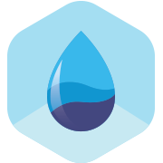

	
  <h1>
		plugin-sentry
	</h1>
  
A BlueBase plugin boilerplate!

## 🎊 Status

 

## 🤝 Compatibility

| 🌏 Web | 🖥 Electron | 📱 React Native |
| :----: | :---------: | :-------------: |
|    ✅   |      ✅      |        ❌        |

## Docs

-   [Storybook](https://mhusnainnaseer786@gmail.com.github.io/plugin-untitled/storybook/)
-   [API Docs](https://mhusnainnaseer786@gmail.com.github.io/plugin-untitled/)
